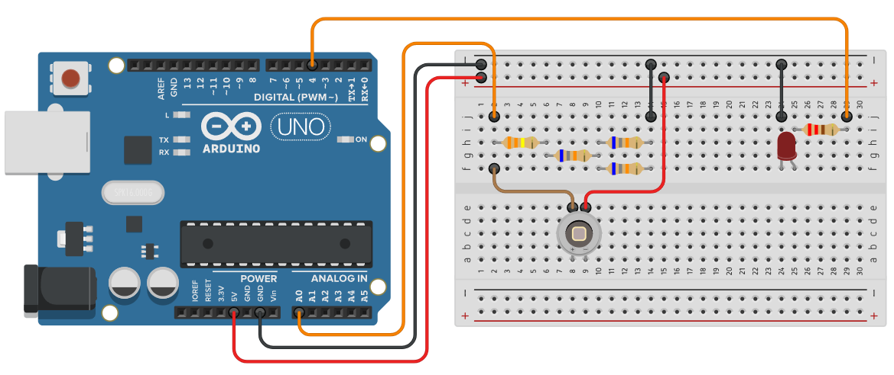
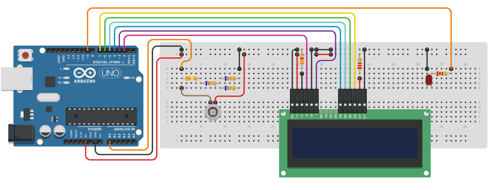

# Concentracion-AuNPs
Este repositorio contiene códigos desarrollados para un sistema basado en Arduino, destinado a la medición en tiempo real de la concentración de nanopartículas de oro mediante medidas de absorbancia.

## Archivos
- `intensidad_fotodiodo.ino` - Código que devuelve la intensidad de luz que incide sobre un fotodiodo, destinado para caracterizar su respuesta en función de varias intensidades de luz. El circuito utilizado con este código es el siguiente:

- `medicion_concentracion.ino` - Código que calcula la absorbancia de una muestra de AuNPs y devuelve su concentración en una pantalla LCD. El circuito utilizado con este código es el siguiente:

## Componentes utilizados
- Arduino Uno
- Placa de pruebas y cables de conexión
- Resistencias (1 x 330 kΩ, 3 x 68 kΩ, 1 x 3.3 kΩ, 2 x 220 Ω) 
- LED rojo
- Fotodiodo SGPD542C8
- Módulo láser compacto de 405 nm (modelo PL205 de Thorlabs)
- Pantalla LCD 16x2
